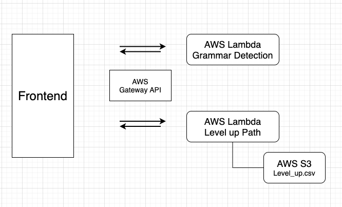

# Level up Project

# Overview
The project will level up grammar from the user input's sentence. It will incorporate the main Linngle website and make users know how to upgrade their grammar level. Therefore, it can improve the users' learning experience and help them correct their writing skills .
First, the team focused on python code, especially in grammar detection, to get a feel for the competition function. Additionally, we also looked at what it already developed on github and combined with the python packages that we can implement on our project. Next, we deployed this function API on AWS lambda, the frontend team can call this API anytime in the future. Finally, it will be programmed, assessed for quality, and launched.

# Hosting and Maintenance
We already deployed the function on AWS and backed up the code on github. If the function will be attacked on the internet, we will delete it and create the new one at short notice.

# Preliminary Design
We deployed our python code on AWS lambda and connected AWS database to fetch the our level up path graph file. The flow as below:

# Deployment Process:

1. Create lambda function

2. IAM -> Role -> lambda_full_access and S3_full_access

3. Create storage in S3

4. Upload python.zip in requirement folder to AWS Lambda Layers

5. Deploy grammar.py on AWS Lambda

